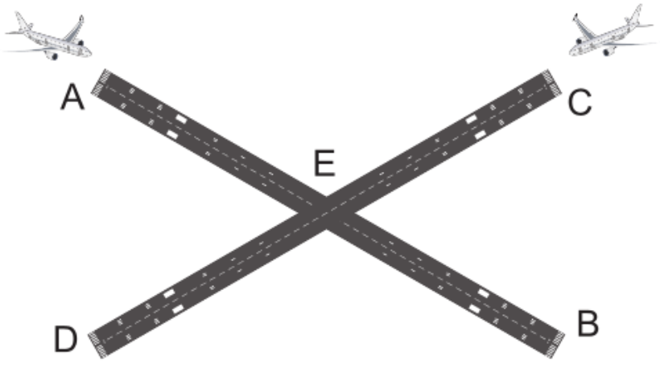

## Airport

Ein Flugplatz hat zwei einander im Punkt E kreuzende(*nicht fragen*) Landebahnen AB und CD. Ankommenden Flugzeugen wird
entweder die Landebahn AB oder CD zugewiesen.  
  
Dabei gelten die folgenden Regeln:

* Jede Landebahn darf zu einem bestimmten Zeitpunkt nur von einem Flugzeug verwendet werden.
* Befindet sich ein Flugzeug auf einer Landebahn **vor** dem Punkt E, so sperrt es auch die andere Landebahn.
  Befindet es sich **nach** dem Punkt E, so ist die andere Landebahn frei.
* Die Simulation des Landevorgangs erfolgt über ``sleep``-Calls, wobei ein Flugzeug 3 Sekunden die Landebahn vor
  dem Punkt E und 5 Sekunden nach dem Punkt E sperrt.

Auf der Konsole soll das Verhalten der Flugzeuge protokolliert werden, beispielsweise

```text
Plane 1 arrives for runway AB
Plane 1 is on runway AB
Plane 1 crosses E on runway AB
Plane 1 leaves runway AB
Plane 2 arrives for runway AB
Plane 2 is on runway AB
Plane 2 crosses E on runway AB
Plane 3 arrives for runway CD
Plane 3 is on runway CD		<---- 2 Flugzeuge GLEICHZEITIG im System
Plane 2 leaves runway AB
Plane 3 crosses E on runway CD
Plane 4 arrives for runway CD
Plane 3 leaves runway CD
```

**Eine Lösung kann nur dann richtig sein, wenn hin und wieder 2 Flugzeuge gleichzeitig unterwegs sind.**